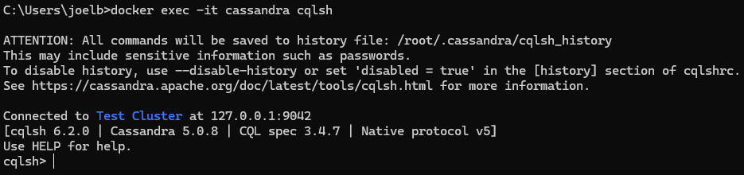
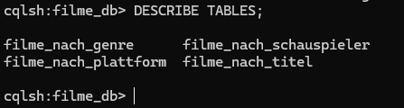
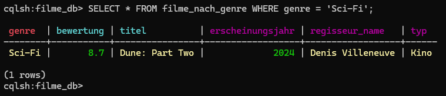

# KN-C-01: Installation und Datenmodellierung für Cassandra

**Thema:** Filme & Serien  
**Datenbank:** `filme_db`

---

## A) Installation / Account erstellen (10%)

### Screenshots



---

## B) Logisches Modell für Cassandra (40%)

### Grundprinzip: Query-First-Design

In Cassandra wird das Datenmodell **nicht** nach Entitäten, sondern nach **Abfragen (Queries)** designed. Jede Tabelle ist auf genau eine Abfrage optimiert. Der **Partition Key** bestimmt, auf welchem Node die Daten gespeichert werden — alle Zeilen mit demselben Partition Key liegen physisch zusammen. Der **Clustering Key** definiert die Sortierung innerhalb einer Partition.

Das konzeptionelle Modell (aus KN-M-02) bleibt gleich: Film, Regisseur, Schauspieler, Plattform. Für Cassandra leiten wir daraus **4 Screens** und **4 Tabellen** ab.

---

### Screen 1: Filmdetail-Seite

**Szenario:** Ein Nutzer sucht einen Film nach Titel und möchte alle Details sehen (Genre, Bewertung, Regisseur, Erscheinungsjahr).

**Benötigte Daten:** titel, erscheinungsjahr, genre, typ, bewertung, regisseur_name, regisseur_nationalitaet

**Abfrage:** `SELECT * FROM filme_nach_titel WHERE titel = 'Oppenheimer'`

**Tabelle: `filme_nach_titel`**

| Key-Typ | Spalte | Datentyp | Begründung |
|---|---|---|---|
| **Partition Key** | `titel` | TEXT | Suche immer nach Titel → alle Daten eines Films landen auf demselben Node |
| **Clustering Key** | `erscheinungsjahr` | INT DESC | Falls es Remakes gibt (gleicher Titel, anderes Jahr), sortiert absteigend (neueste zuerst) |
| — | `genre` | TEXT | |
| — | `typ` | TEXT | |
| — | `bewertung` | FLOAT | |
| — | `regisseur_name` | TEXT | Denormalisiert eingebettet (kein JOIN möglich in Cassandra) |
| — | `regisseur_nat` | TEXT | |

---

### Screen 2: Genre-Browsing

**Szenario:** Ein Nutzer möchte alle Filme eines bestimmten Genres durchstöbern, sortiert nach Bewertung (beste zuerst).

**Benötigte Daten:** genre, bewertung, titel, erscheinungsjahr, typ, regisseur_name

**Abfrage:** `SELECT * FROM filme_nach_genre WHERE genre = 'Sci-Fi'`

**Tabelle: `filme_nach_genre`**

| Key-Typ | Spalte | Datentyp | Begründung |
|---|---|---|---|
| **Partition Key** | `genre` | TEXT | Alle Filme eines Genres liegen zusammen auf einem Node |
| **Clustering Key 1** | `bewertung` | FLOAT DESC | Sortierung: beste Bewertung zuerst |
| **Clustering Key 2** | `titel` | TEXT ASC | Sekundärsortierung: bei gleicher Bewertung alphabetisch |
| — | `erscheinungsjahr` | INT | |
| — | `typ` | TEXT | |
| — | `regisseur_name` | TEXT | |

---

### Screen 3: Schauspieler-Profilseite

**Szenario:** Ein Nutzer klickt auf einen Schauspieler und sieht alle Filme in denen er mitgespielt hat, mit seiner Rolle und sortiert nach Erscheinungsjahr (neueste zuerst).

**Benötigte Daten:** schauspieler_name, erscheinungsjahr, titel, genre, bewertung, rolle

**Abfrage:** `SELECT * FROM filme_nach_schauspieler WHERE schauspieler_name = 'Margot Robbie'`

**Tabelle: `filme_nach_schauspieler`**

| Key-Typ | Spalte | Datentyp | Begründung |
|---|---|---|---|
| **Partition Key** | `schauspieler_name` | TEXT | Alle Filme eines Schauspielers auf demselben Node |
| **Clustering Key 1** | `erscheinungsjahr` | INT DESC | Neueste Filme zuerst |
| **Clustering Key 2** | `titel` | TEXT ASC | Sekundärsortierung bei gleichem Jahr |
| — | `genre` | TEXT | |
| — | `bewertung` | FLOAT | |
| — | `rolle` | TEXT | Die gespielte Rolle — gehört zur Schauspieler-Film-Kombination |

---

### Screen 4: Plattform-Übersichtsseite

**Szenario:** Ein Nutzer öffnet eine Plattform (z.B. Netflix) und sieht alle verfügbaren Filme, gruppiert nach Genre und dann alphabetisch nach Titel.

**Benötigte Daten:** plattform_name, genre, titel, erscheinungsjahr, bewertung, plattform_typ, plattform_preis

**Abfrage:** `SELECT * FROM filme_nach_plattform WHERE plattform_name = 'Netflix'`

**Tabelle: `filme_nach_plattform`**

| Key-Typ | Spalte | Datentyp | Begründung |
|---|---|---|---|
| **Partition Key** | `plattform_name` | TEXT | Alle Filme einer Plattform auf demselben Node |
| **Clustering Key 1** | `genre` | TEXT ASC | Gruppierung nach Genre |
| **Clustering Key 2** | `titel` | TEXT ASC | Innerhalb Genre alphabetisch |
| — | `erscheinungsjahr` | INT | |
| — | `bewertung` | FLOAT | |
| — | `plattform_typ` | TEXT | Denormalisiert — kein JOIN möglich |
| — | `plattform_preis` | FLOAT | |

---

### Warum Denormalisierung?

In Cassandra gibt es **keine JOINs**. Daten die zusammen abgefragt werden, müssen zusammen gespeichert werden. Deshalb werden Regisseur-Details direkt in `filme_nach_titel` eingebettet, Plattform-Details direkt in `filme_nach_plattform`, usw. Das ist in Cassandra korrekt und erwünscht — man akzeptiert Datenduplizierung für maximale Lesegeschwindigkeit.

---

### Visuelles Modell

```
filme_nach_titel
┌─────────────────────────────────────────────────────────────────┐
│ PK  titel TEXT                                                  │
│ CK  erscheinungsjahr INT  (DESC)                                │
│     genre TEXT                                                  │
│     typ TEXT                                                    │
│     bewertung FLOAT                                             │
│     regisseur_name TEXT                                         │
│     regisseur_nat TEXT                                          │
└─────────────────────────────────────────────────────────────────┘

filme_nach_genre
┌─────────────────────────────────────────────────────────────────┐
│ PK  genre TEXT                                                  │
│ CK  bewertung FLOAT  (DESC)                                     │
│ CK  titel TEXT  (ASC)                                           │
│     erscheinungsjahr INT                                        │
│     typ TEXT                                                    │
│     regisseur_name TEXT                                         │
└─────────────────────────────────────────────────────────────────┘

filme_nach_schauspieler
┌─────────────────────────────────────────────────────────────────┐
│ PK  schauspieler_name TEXT                                      │
│ CK  erscheinungsjahr INT  (DESC)                                │
│ CK  titel TEXT  (ASC)                                           │
│     genre TEXT                                                  │
│     bewertung FLOAT                                             │
│     rolle TEXT                                                  │
└─────────────────────────────────────────────────────────────────┘

filme_nach_plattform
┌─────────────────────────────────────────────────────────────────┐
│ PK  plattform_name TEXT                                         │
│ CK  genre TEXT  (ASC)                                           │
│ CK  titel TEXT  (ASC)                                           │
│     erscheinungsjahr INT                                        │
│     bewertung FLOAT                                             │
│     plattform_typ TEXT                                          │
│     plattform_preis FLOAT                                       │
└─────────────────────────────────────────────────────────────────┘
```

---

## C) Physisches Modell für Cassandra (50%)

### Script: [`c_physical_model.cql`](Dateien/c_physical_model.cql)

Das Script erstellt den Keyspace, alle 4 Tabellen und fügt Testdaten ein.

**Ausführen in cqlsh:**
```bash
cqlsh -f c_physical_model.cql
```

**Oder Zeile für Zeile in cqlsh einfügen.**

Das Script erstellt:

| Was | Anzahl |
|---|---|
| Keyspace | 1 (`filme_db`) |
| Tabellen | 4 |
| Testdatensätze | 21 (über alle 4 Tabellen) |

### Screenshots



