# KN-C-02: Datenabfrage und -Manipulation (Cassandra)

**Thema:** Filme & Serien  
**Datenbank:** `filme_db`

---

## A) Daten hinzufügen (25%)

### Script: [`a_insert_data.txt`](Dateien/a_insert_data.txt)

Das Script fügt zusätzliche Testdaten in alle 4 Tabellen ein. Pro Partition Key sind mehrere Datensätze vorhanden — z.B. hat die Partition `genre = 'Sci-Fi'` jetzt 4 Einträge (Dune: Part Two, Inception, Interstellar, Dune), und `schauspieler_name = 'Leonardo DiCaprio'` hat 3 Einträge (Inception, The Wolf of Wall Street, The Irishman).

| Tabelle | Neue Zeilen |
|---|---|
| `filme_nach_titel` | 5 |
| `filme_nach_genre` | 5 |
| `filme_nach_schauspieler` | 5 |
| `filme_nach_plattform` | 5 |


---

## B) Daten abfragen (25%)

### Script: [`b_query_data.txt`](Dateien/b_query_data.txt)

Die Abfragen entsprechen den 4 Screens aus KN-C-01:

| # | Screen | Abfrage | Technik |
|---|---|---|---|
| B1 | Filmdetail | Film nach Titel suchen | WHERE auf Partition Key |
| B2 | Genre-Browsing | Alle Sci-Fi Filme | WHERE auf Partition Key, Clustering Key Sortierung |
| B2b | Genre-Browsing | Sci-Fi mit Bewertung > 8.5 | WHERE auf Partition Key + Clustering Key Filter |
| B3 | Schauspieler-Profil | Alle Filme von DiCaprio | WHERE auf Partition Key |
| B4 | Plattform-Übersicht | Alle Filme auf Netflix | WHERE auf Partition Key |
| B4b | Plattform-Übersicht | Nur Sci-Fi auf Netflix | WHERE auf Partition Key + Clustering Key |


---

## C) Daten löschen (25%)

### Script 1: [`c_delete_data.txt`](Dateien/c_delete_data.txt)

Drei verschiedene Lösch-Szenarien:

**1) Einzelne Zeile löschen** mit Partition Key + allen Clustering Keys:
```sql
DELETE FROM filme_nach_genre
WHERE genre = 'Drama' AND bewertung = 7.3 AND titel = 'Okja';
```
In Cassandra muss bei `DELETE` der vollständige Primary Key angegeben werden (Partition Key + alle Clustering Keys), um eine einzelne Zeile zu löschen.

**2) Einzelne Spalte löschen** (neue Funktion in Cassandra):
```sql
DELETE regisseur_nat FROM filme_nach_titel
WHERE titel = 'Interstellar' AND erscheinungsjahr = 2014;
```
Cassandra erlaubt es, einzelne Spalten einer Zeile zu löschen — der Wert wird auf `NULL` gesetzt. Dies ist bei relationalen Datenbanken nicht üblich. Ja, man kann einzelne Spalten von einzelnen Zeilen löschen.

**3) Ganze Partition löschen** (alle Zeilen eines Schauspielers):
```sql
DELETE FROM filme_nach_schauspieler
WHERE schauspieler_name = 'Song Kang-ho';
```

### Script 2: [`c_truncate_all.txt`](Dateien/c_truncate_all.txt)

Löscht alle Daten aus allen Tabellen mit `TRUNCATE` — die Tabellenstruktur bleibt erhalten. Dient als Aufräum-Script, damit die Daten danach neu eingefügt werden können.


---

## D) Daten verändern (25%)

### Script: [`d_update_data.txt`](Dateien/d_update_data.txt)

### Szenario U1: Filmbewertung aktualisieren (mehrere Tabellen)

Nach einer Neubewertung durch die Redaktion erhält "Barbie" eine höhere Bewertung von 7.2 auf 7.8. Da die Bewertung in zwei Tabellen gespeichert ist, muss sie in beiden aktualisiert werden. In `filme_nach_titel` geht das direkt mit `UPDATE`. In `filme_nach_genre` ist `bewertung` ein Clustering Key und kann nicht direkt geändert werden — der alte Eintrag muss zuerst gelöscht und dann neu mit der korrekten Bewertung eingefügt werden.

```sql
UPDATE filme_nach_titel SET bewertung = 7.8
WHERE titel = 'Barbie' AND erscheinungsjahr = 2023;

DELETE FROM filme_nach_genre
WHERE genre = 'Satire-Komoedie' AND bewertung = 7.2 AND titel = 'Barbie';

INSERT INTO filme_nach_genre (genre, bewertung, titel, erscheinungsjahr, typ, regisseur_name)
VALUES ('Satire-Komoedie', 7.8, 'Barbie', 2023, 'Kino', 'Greta Gerwig');
```

### Szenario U2: Plattformpreis erhöhen

Netflix erhöht seinen Monatspreis von 19.90 auf 21.90 CHF. Da `plattform_preis` eine normale Spalte ist, kann sie direkt mit `UPDATE` pro Zeile aktualisiert werden. Weil in Cassandra kein `UPDATE` über eine ganze Partition möglich ist, wird jede Zeile einzeln aktualisiert.

```sql
UPDATE filme_nach_plattform SET plattform_preis = 21.90
WHERE plattform_name = 'Netflix' AND genre = 'Historisches Drama' AND titel = 'Oppenheimer';
```

### Szenario U3: Rolle eines Schauspielers korrigieren

Die Rolle von Cillian Murphy in Inception wurde falsch erfasst ("Robert Fischer" statt "Robert Michael Fischer"). Da `rolle` eine normale Spalte auf der Zeile ist, kann sie direkt mit `UPDATE` korrigiert werden — der vollständige Primary Key muss angegeben werden.

```sql
UPDATE filme_nach_schauspieler SET rolle = 'Robert Michael Fischer'
WHERE schauspieler_name = 'Cillian Murphy'
AND erscheinungsjahr = 2010
AND titel = 'Inception';
```

---

## Abgabe-Dateien

| Datei | Teil | Beschreibung |
|---|---|---|
| [`a_insert_data.txt`](Dateien/a_insert_data.txt) | A | Zusätzliche Daten einfügen |
| [`b_query_data.txt`](Dateien/b_query_data.txt) | B | Abfragen für alle 4 Screens |
| [`c_delete_data.txt`](Dateien/c_delete_data.txt) | C | Zeilen und Spalten löschen |
| [`c_truncate_all.txt`](Dateien/c_truncate_all.txt) | C | Alle Daten löschen (Aufräumen) |
| [`d_update_data.txt`](Dateien/d_update_data.txt) | D | 3 Update-Szenarien |

### Screenshot

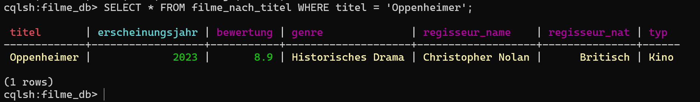
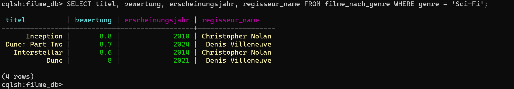
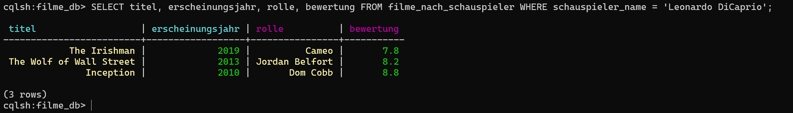
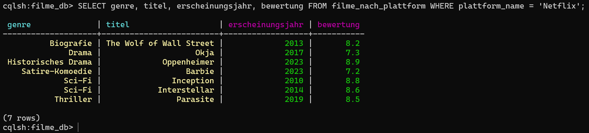
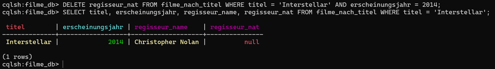
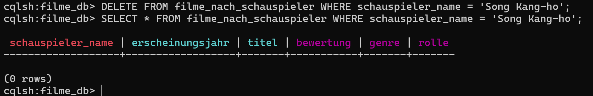
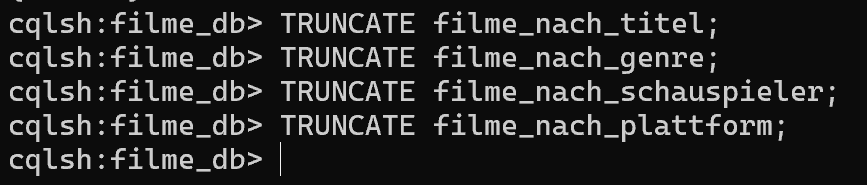
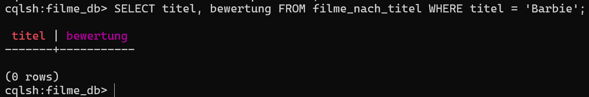
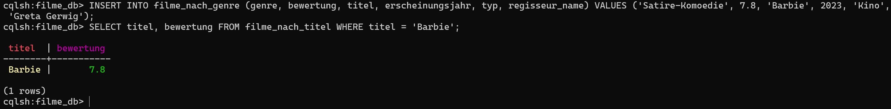
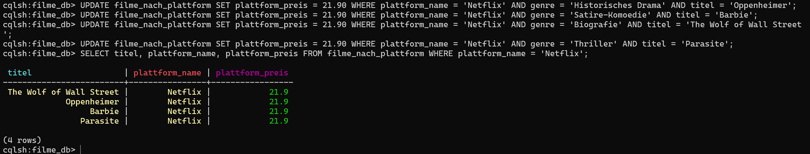
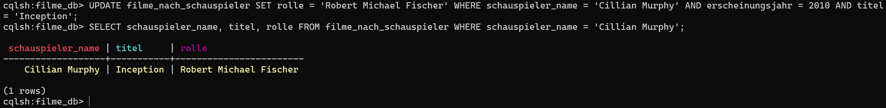
