# KN-M-01: Installation und Verwaltung von MongoDB

---

## A) Installation (30%)

### 1. Cloud-Init Datei

Die Cloud-Init Datei befindet sich im selben Ordner wie diese Dokumentation.

➡️ [cloud-init.yaml](./cloud-init.yaml)

---

### 2. Compass – Bestehende Datenbanken

---

### 3. `authSource=admin` erklärt

Der Parameter `authSource=admin` teilt MongoDB mit, **in welcher Datenbank der Benutzer gespeichert ist** und dort authentifiziert werden soll.

**Warum ist `admin` korrekt?**

Im Cloud-Init wurde der Benutzer mit `use admin` erstellt – er ist also in der `admin`-Datenbank gespeichert:

```javascript
use admin;
db.createUser({
  user: "admin",
  pwd: "MeinPasswort.99",
  roles: [...]
});
```

MongoDB speichert Benutzer in der Collection `system.users` der jeweiligen Datenbank. Da unser Benutzer in `admin` erstellt wurde, muss `authSource=admin` angegeben werden – sonst findet MongoDB den Benutzer nicht und verweigert die Verbindung.

---

### 4. Die beiden `sed`-Befehle erklärt

`sed` (Stream Editor) ist ein Linux-Tool zum automatischen Suchen und Ersetzen von Text in Dateien.

**Befehl 1 – BindIP ändern:**
```bash
sudo sed -i 's/127.0.0.1/0.0.0.0/g' /etc/mongod.conf
```
Ersetzt `127.0.0.1` mit `0.0.0.0`. Ohne diese Änderung akzeptiert MongoDB nur lokale Verbindungen – Compass von einem externen PC würde nicht funktionieren.

**Befehl 2 – Authentifizierung aktivieren:**
```bash
sudo sed -i 's/#security:/security:\n  authorization: enabled/g' /etc/mongod.conf
```
Aktiviert die Authentifizierung. Ohne diese Änderung kann jeder ohne Login auf die Datenbank zugreifen.

**Warum sind diese Befehle notwendig?**
MongoDB wird aus Sicherheitsgründen mit restriktiven Standardeinstellungen installiert. `sed` automatisiert die notwendigen Anpassungen, damit wir die Datenbank von aussen erreichen und sicher mit Passwort nutzen können.

---

### 5. MongoDB Konfigurationsdatei

---

## B) Erste Schritte GUI (30%)

### 1. Dokument vor dem Einfügen

---

### 2. Dokument nach Anpassung des Datentyps

---

### 3. Export-Datei & Erklärung

**Erklärung:**

JSON kennt keinen eigenen Datum-Datentyp. Gibt man `"2008-04-22"` ein, wird es automatisch als **String** gespeichert – nicht als echtes Datum.

Um ein Datum direkt korrekt einzufügen, hätte man das BSON-Format `$date` verwenden müssen:

```json
{ "Geburtsdatum": { "$date": "2008-04-22T00:00:00.000Z" } }
```

MongoDB versteht `$date` als echten Datum-Datentyp (BSON) und speichert es korrekt.

**Implikationen auf andere Datentypen:**
Dasselbe Problem betrifft auch andere Typen. Zum Beispiel wird `"200"` (mit Anführungszeichen) als String gespeichert statt als Integer `200`. Das kann bei Berechnungen oder Abfragen zu falschen Resultaten führen.

**Warum dieser komplizierte Weg?**
JSON ist ein simples Format mit nur wenigen Grundtypen (String, Number, Boolean, Array, Object, null). MongoDB erweitert JSON intern mit BSON, um zusätzliche Typen wie `Date`, `Int32` oder `ObjectId` zu unterstützen – diese müssen jedoch explizit angegeben werden.

---

## C) Erste Schritte Shell (10%)

### Screenshot Compass Shell

---

### Screenshot MongoDB Shell (Linux-Server)

---

### Was machen die Befehle 1–5?

| Befehl | Funktion |
|---|---|
| `show dbs` | Zeigt alle Datenbanken mit Grösse an |
| `show databases` | Identisch mit `show dbs` |
| `use Bandle` | Wechselt in die Datenbank `Bandle` |
| `show collections` | Zeigt alle Collections der aktuellen Datenbank |
| `show tables` | Identisch mit `show collections` (SQL-Alias) |

### Unterschied: Collections vs. Tables

**Tables** (SQL) – Daten sind in festen Zeilen und Spalten gespeichert. Jede Zeile hat dieselbe Struktur (strenges Schema).

**Collections** (MongoDB/NoSQL) – Speichern flexible JSON-Dokumente ohne festes Schema. Dokumente in derselben Collection können unterschiedliche Felder haben.

`show tables` existiert in MongoDB nur als Alias für Benutzer, die SQL gewohnt sind.

---

## D) Rechte und Rollen (30%)

### 1. Fehler bei falscher `authSource`

---

### 2. Skript zur Benutzererstellung

```javascript
// Benutzer 1: leser – nur Lesen, gespeichert in Bandle
use Bandle
db.createUser({
  user: "leser",
  pwd: "leser123",
  roles: [{ role: "read", db: "Bandle" }]
})

// Benutzer 2: schreiber – Lesen & Schreiben, gespeichert in admin
use admin
db.createUser({
  user: "schreiber",
  pwd: "schreiber123",
  roles: [{ role: "readWrite", db: "Bandle" }]
})

---

```

## Bilder

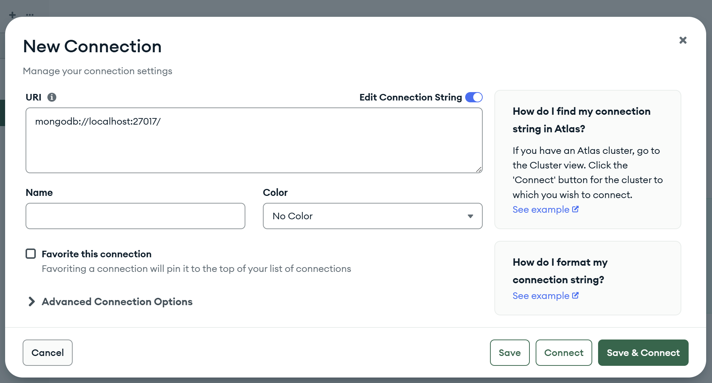
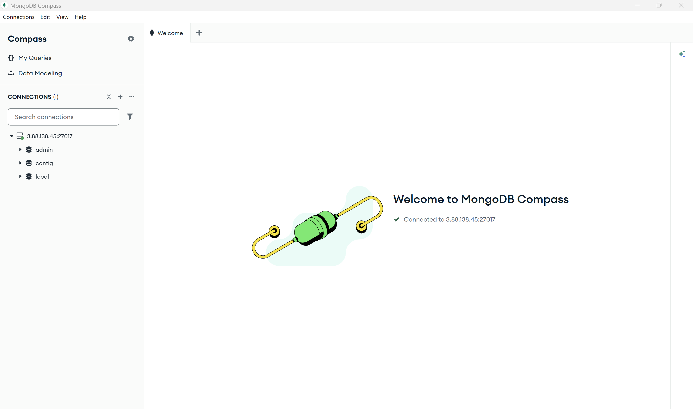
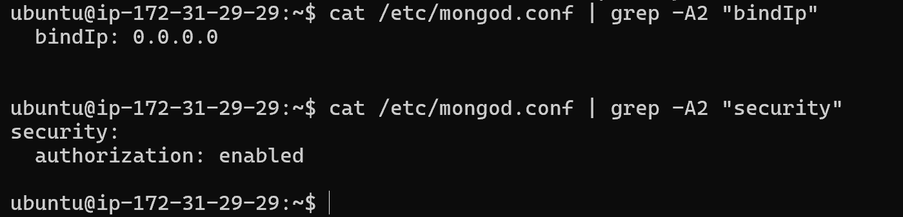
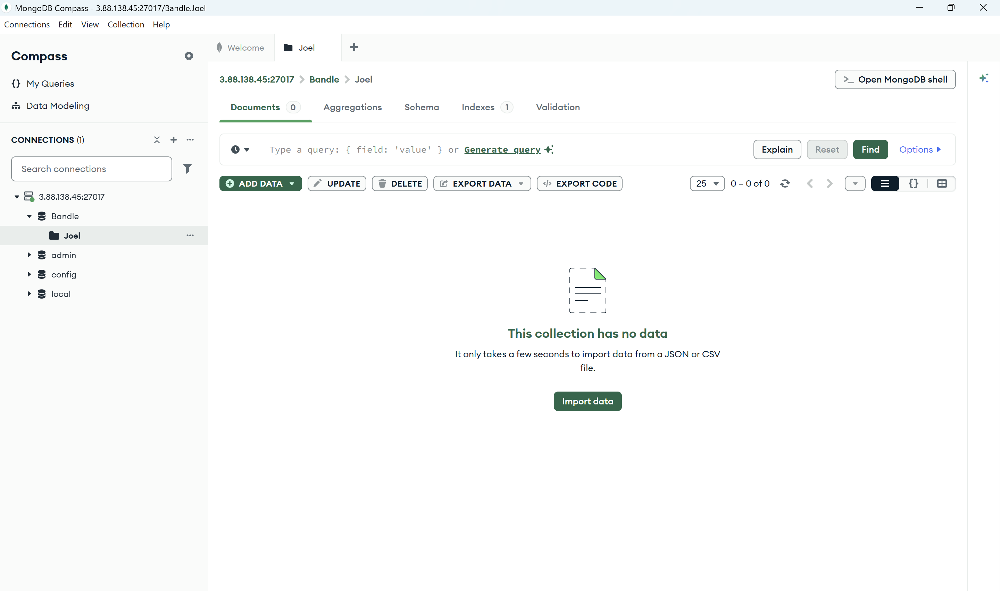
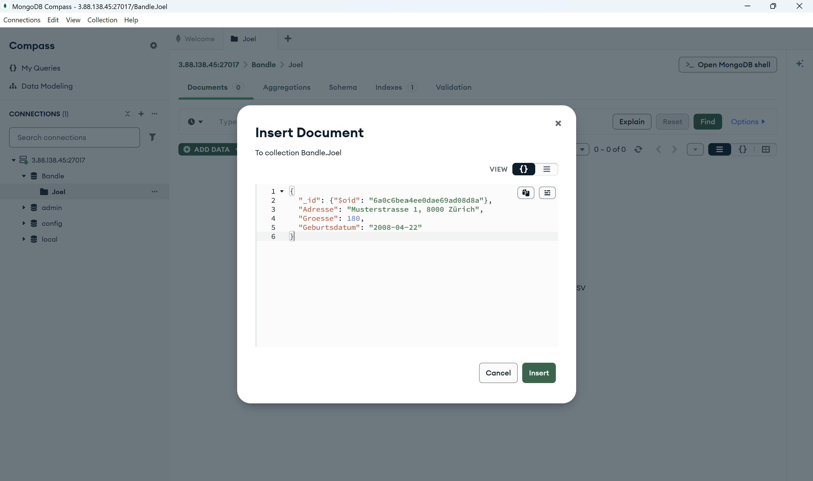
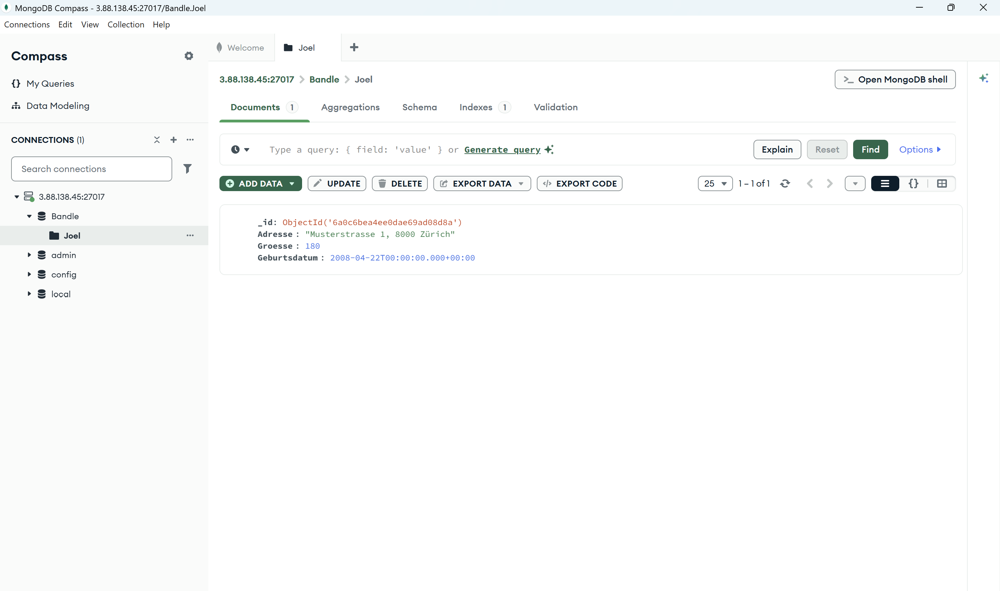
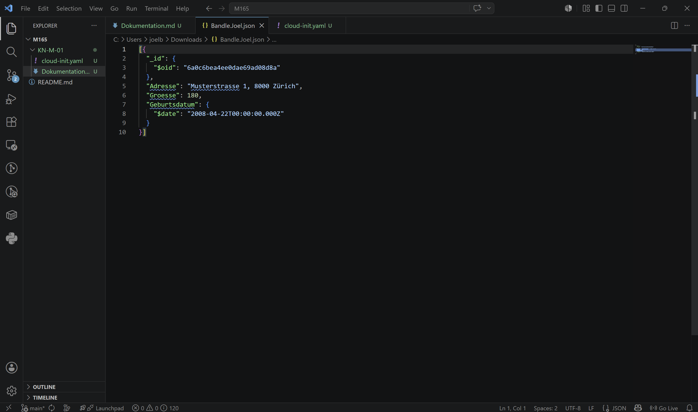

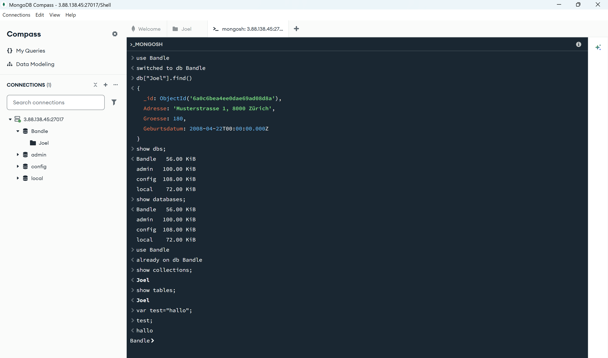
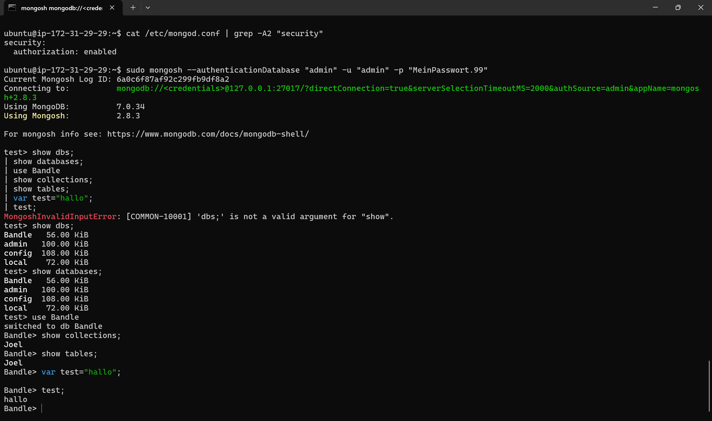
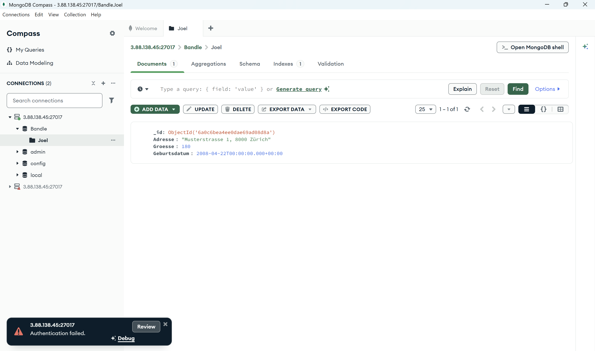
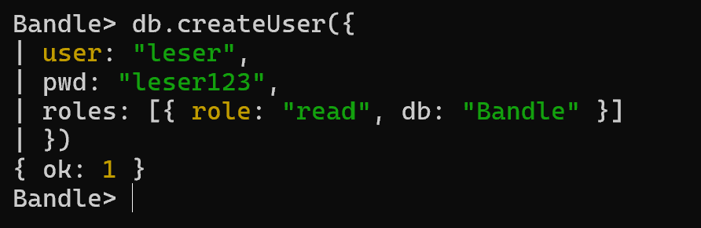
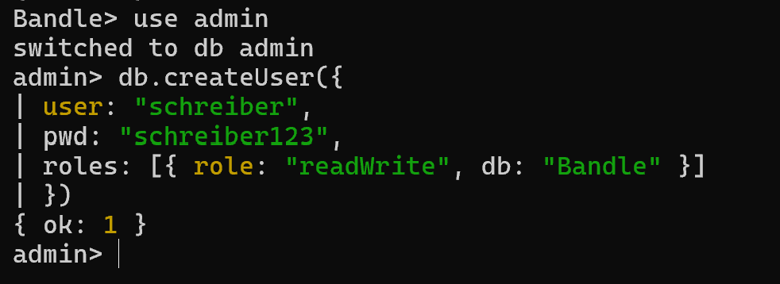
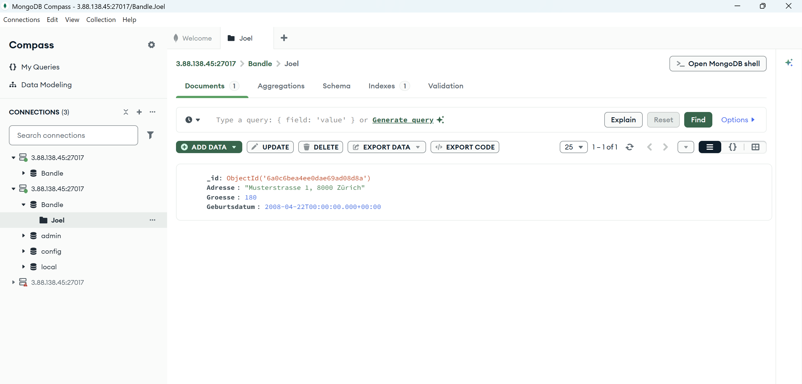

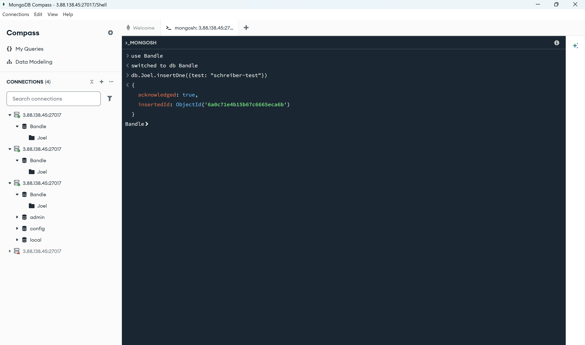