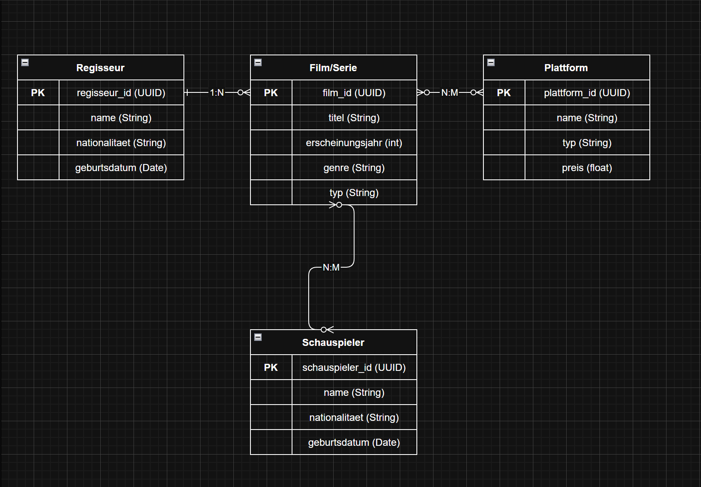
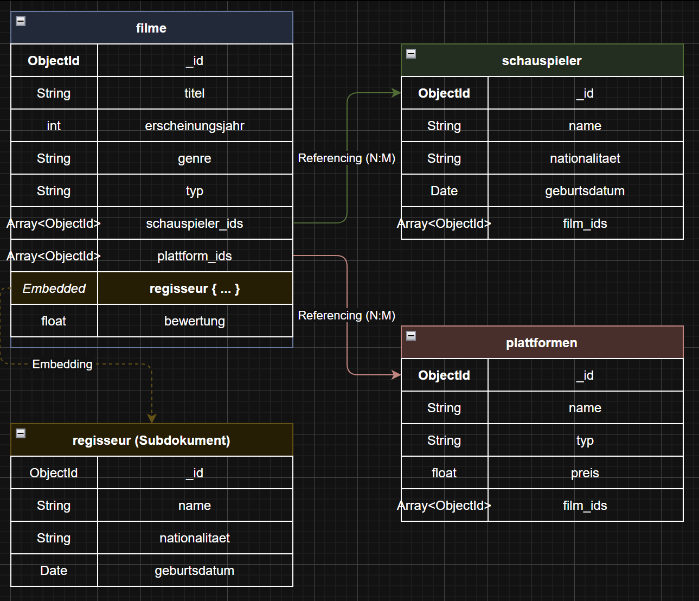
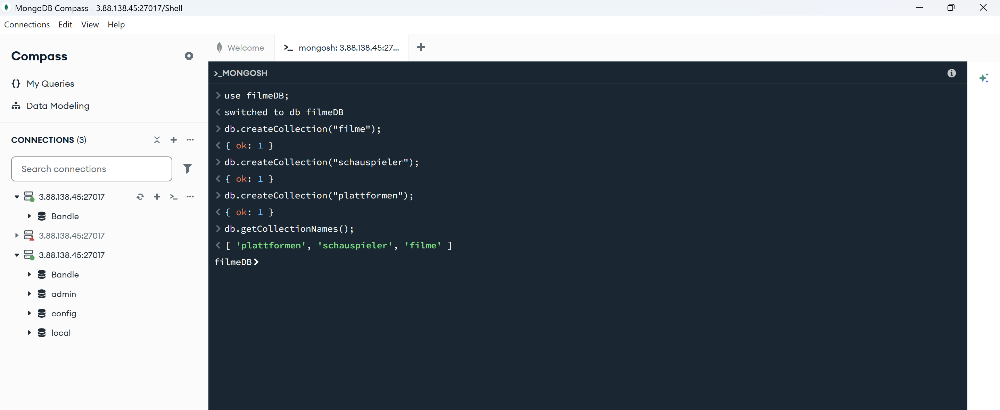

# KN-M-02: Datenmodellierung für MongoDB

---

**Thema:** Filme & Serien  
**Datenbank:** `filmeDB`

---

## A) Konzeptionelles Datenmodell (30%)

### Diagramm

### Beschreibung

Das konzeptionelle Datenmodell bildet eine Film- und Serien-Datenbank ab und besteht aus **vier Entitäten**. Das Thema eignet sich gut für eine MongoDB-Modellierung, da die Beziehungen zwischen Filmen, Schauspielern und Plattformen vielfältig und flexibel sind.

### Entitäten

#### Film/Serie

Die zentrale Entität des Modells. Enthält Titel, Erscheinungsjahr, Genre, Typ (Film oder Serie) und eine Bewertung. Jeder Film/Serie hat über `regisseur_id` eine Referenz auf seinen Regisseur.

| Attribut | Datentyp | Beschreibung |
|---|---|---|
| `film_id` | UUID | Primärschlüssel |
| `titel` | String | Name des Films/der Serie |
| `erscheinungsjahr` | int | Jahr der Veröffentlichung |
| `genre` | String | Genre (z.B. Action, Drama) |
| `typ` | String | Film oder Serie |
| `bewertung` | float | Durchschnittsbewertung (0.0–10.0) |

#### Regisseur

Speichert Informationen über Regisseure: Name, Nationalität und Geburtsdatum. Jeder Regisseur wird über eine eindeutige `regisseur_id` identifiziert.

| Attribut | Datentyp | Beschreibung |
|---|---|---|
| `regisseur_id` | UUID | Primärschlüssel |
| `name` | String | Name des Regisseurs |
| `nationalitaet` | String | Herkunftsland |
| `geburtsdatum` | Date | Geburtsdatum |

#### Schauspieler

Enthält Name, Nationalität und Geburtsdatum der Schauspieler, identifiziert durch `schauspieler_id`.

| Attribut | Datentyp | Beschreibung |
|---|---|---|
| `schauspieler_id` | UUID | Primärschlüssel |
| `name` | String | Name des Schauspielers |
| `nationalitaet` | String | Herkunftsland |
| `geburtsdatum` | Date | Geburtsdatum |

#### Plattform

Beschreibt Streaming-Plattformen mit Name, Typ und Preis, identifiziert durch `plattform_id`.

| Attribut | Datentyp | Beschreibung |
|---|---|---|
| `plattform_id` | UUID | Primärschlüssel |
| `name` | String | Plattformname (z.B. Netflix) |
| `typ` | String | Streaming, Kino, DVD, etc. |
| `preis` | float | Monatspreis in CHF |

### Beziehungen

#### Regisseur → Film/Serie (1:N)

Ein Regisseur kann mehrere Filme/Serien drehen, aber jeder Film/Serie hat genau einen Regisseur.

#### Film/Serie ↔ Schauspieler (N:M)

Ein Film kann mehrere Schauspieler haben, und ein Schauspieler kann in mehreren Filmen mitspielen. Dies ist eine **netzwerkförmige Beziehung**.

#### Film/Serie ↔ Plattform (N:M)

Ein Film kann auf mehreren Plattformen verfügbar sein, und eine Plattform bietet mehrere Filme an. Dies ist die zweite **netzwerkförmige Beziehung**.

---

## B) Logisches Modell für MongoDB (60%)

### Diagramm

### Übersicht

Das logische Modell besteht aus **3 Collections**: `filme`, `schauspieler` und `plattformen`. Die Entität **Regisseur** wird nicht als eigene Collection geführt, sondern direkt in `filme` eingebettet (Embedding).

### Collection: `filme`

```json
{
  "_id": "ObjectId",
  "titel": "String",
  "erscheinungsjahr": "int",
  "genre": "String",
  "typ": "String",
  "bewertung": "float",
  "schauspieler_ids": ["ObjectId", "ObjectId"],
  "plattform_ids": ["ObjectId", "ObjectId"],
  "regisseur": {
    "_id": "ObjectId",
    "name": "String",
    "nationalitaet": "String",
    "geburtsdatum": "Date"
  }
}
```

### Collection: `schauspieler`

```json
{
  "_id": "ObjectId",
  "name": "String",
  "nationalitaet": "String",
  "geburtsdatum": "Date",
  "film_ids": ["ObjectId", "ObjectId"]
}
```

### Collection: `plattformen`

```json
{
  "_id": "ObjectId",
  "name": "String",
  "typ": "String",
  "preis": "float",
  "film_ids": ["ObjectId", "ObjectId"]
}
```

### Verwendete Datentypen

| Datentyp | Verwendung |
|---|---|
| `String` | titel, genre, typ, name, nationalitaet |
| `int` | erscheinungsjahr |
| `float` | bewertung, preis |
| `Date` | geburtsdatum |
| `ObjectId` | _id, schauspieler_ids, plattform_ids, film_ids |

### Erklärung zur Verschachtelung

#### Warum Embedding für Regisseur?

Der Regisseur wird in `filme` eingebettet (Embedding), weil jeder Film genau **einen** Regisseur hat (1:N-Beziehung) und sich Regisseur-Daten wie Name und Nationalität **selten ändern**. Beim Abfragen eines Films möchte man den Regisseur direkt mitsehen, ohne einen zweiten Lookup auf eine separate Collection machen zu müssen. **Embedding optimiert hier die Lesezugriffe.**

#### Alternative: Referencing

Die Alternative wäre Referencing — also eine eigene `regisseure`-Collection mit Verweis über eine `regisseur_id`. Das wäre sinnvoll, wenn Regisseur-Daten häufig aktualisiert würden oder wenn man oft alle Filme eines Regisseurs sucht. Da Regisseur-Daten aber stabil sind und der häufigste Zugriff „zeig mir einen Film mit allen Details" ist, wurde **Embedding** gewählt.

#### N:M-Beziehungen mit Referencing

Für die N:M-Beziehungen (Film ↔ Schauspieler, Film ↔ Plattform) wird **Referencing mit bidirektionalen ObjectId-Arrays** verwendet. Embedding wäre hier problematisch, da ein Schauspieler in vielen Filmen mitspielen kann und die Daten bei Änderungen an mehreren Stellen aktualisiert werden müssten (Inkonsistenzgefahr). Bidirektionale Referenzen ermöglichen effiziente Abfragen von beiden Seiten:

- „Welche Schauspieler spielen in Film X?"
- „In welchen Filmen spielt Schauspieler Y?"

---

## C) Anwendung des Schemas in MongoDB (10%)

### Script: `create_collections.js`

**Schritt 1:** Zuerst wird separat der Befehl ausgeführt:

```javascript
use filmeDB;
```

**Schritt 2:** Danach wird das Script ausgeführt, welches die Collections erstellt:

```javascript
// KN-M-02 Teil C: Collections erstellen
// Thema: Filme & Serien
// WICHTIG: Zuerst separat ausfuehren: use filmeDB;

db.createCollection("filme");
db.createCollection("schauspieler");
db.createCollection("plattformen");

db.getCollectionNames();
```

### Screenshot: Collections erstellt



