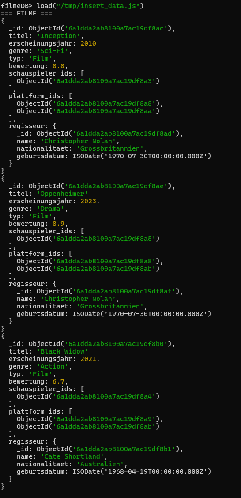
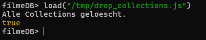
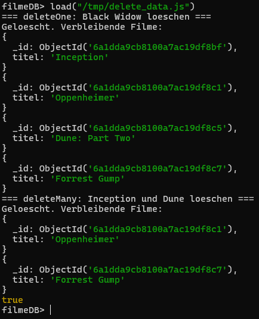
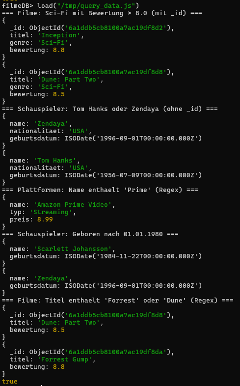
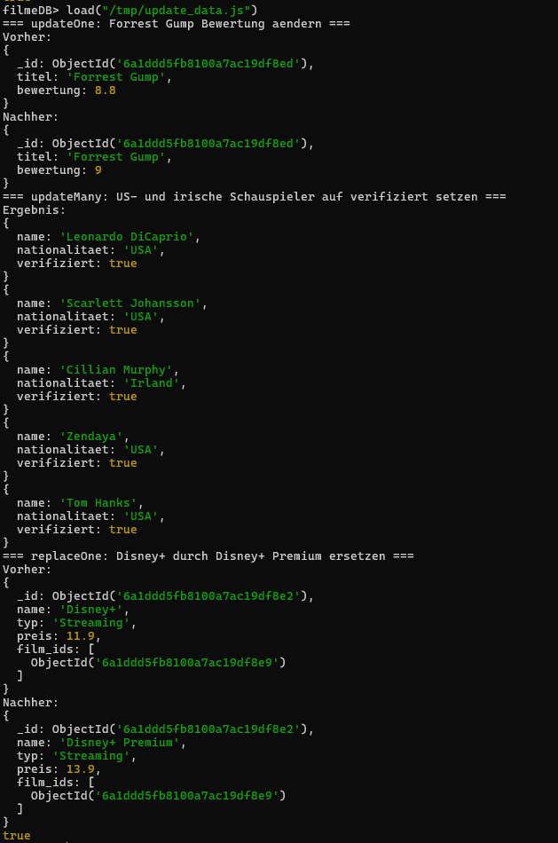

# KN-M-03: Datenmanipulation und Abfragen I

**Thema:** Filme & Serien  
**Datenbank:** `filmeDB`

---

## A) Daten hinzufügen (25%)

### Script: [`insert_data.js`](Dateien/insert_data.js)

Das Script fügt Testdaten in alle drei Collections ein:

| Collection | Anzahl | Methode |
|---|---|---|
| `schauspieler` | 5 Datensätze | `insertMany()` |
| `plattformen` | 4 Datensätze | `insertMany()` |
| `filme` | 5 Datensätze | `insertOne()` (pro Film) |

Alle `_id`-Felder werden über Variablen mit `new ObjectId()` gesetzt — keine hartcodierten Werte. Die Rückreferenzen (`film_ids` in schauspieler/plattformen) werden am Ende des Scripts aktualisiert.

---

## B) Daten löschen (25%)

### Script 1: [`drop_collections.js`](Dateien/drop_collections.js)

Löscht alle Collections mit `collection.drop()`. Dient als Aufräum-Script, um danach mit einer leeren Datenbank neu starten zu können.

```javascript
db.filme.drop();
db.schauspieler.drop();
db.plattformen.drop();
```

### Script 2: [`delete_data.js`](Dateien/delete_data.js)

Löscht einzelne Datensätze aus der Collection `filme`:

| Befehl | Was wird gelöscht | Filter |
|---|---|---|
| `deleteOne()` | Black Widow | `_id` des Films |
| `deleteMany()` | Inception und Dune: Part Two | `$or` mit zwei `_id`-Werten |

Nach dem Löschen bleiben **Oppenheimer** und **Forrest Gump** übrig — es werden also nicht alle Datensätze gelöscht.

---

## C) Daten abfragen (25%)

### Script: [`query_data.js`](Dateien/query_data.js)

| # | Collection | Was | Technik |
|---|---|---|---|
| 1 | `filme` | Sci-Fi mit Bewertung > 8.0 | **UND-Verknüpfung** (`$and`), Projektion **mit** `_id` |
| 2 | `schauspieler` | Tom Hanks oder Zendaya | **ODER-Verknüpfung** (`$or`), Projektion **ohne** `_id` |
| 3 | `plattformen` | Name enthält "Prime" | **Regex** (`$regex`) |
| 4 | `schauspieler` | Geboren nach 01.01.1980 | **DateTime-Filterung** (`$gt` auf Date) |
| 5 | `filme` | Titel enthält "Forrest" oder "Dune" | **Regex** (`$regex`), Projektion **mit** `_id` |

---

## D) Daten verändern (25%)

### Script: [`update_data.js`](Dateien/update_data.js)

Jeder Befehl wird auf einer **anderen Collection** ausgeführt:

| # | Collection | Befehl | Was passiert | Filter |
|---|---|---|---|---|
| 1 | `filme` | `updateOne()` | Forrest Gump Bewertung → 9.0 | `_id` |
| 2 | `schauspieler` | `updateMany()` | US- und irische Schauspieler → `verifiziert: true` | `$or` auf `nationalitaet` |
| 3 | `plattformen` | `replaceOne()` | Disney+ → Disney+ Premium | `_id` |

---

## Abgabe-Dateien

| Datei | Teil | Beschreibung |
|---|---|---|
| [`insert_data.js`](Dateien/insert_data.js) | A | Daten einfügen (insertOne + insertMany) |
| [`drop_collections.js`](Dateien/drop_collections.js) | B | Alle Collections löschen |
| [`delete_data.js`](Dateien/delete_data.js) | B | Einzelne Datensätze löschen (deleteOne + deleteMany) |
| [`query_data.js`](Dateien/query_data.js) | C | Abfragen (find mit Filtern, Regex, Projektionen) |
| [`update_data.js`](Dateien/update_data.js) | D | Daten ändern (updateOne, updateMany, replaceOne) |

---

## Screenshots





