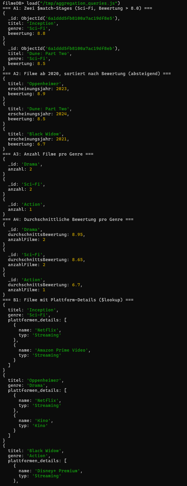
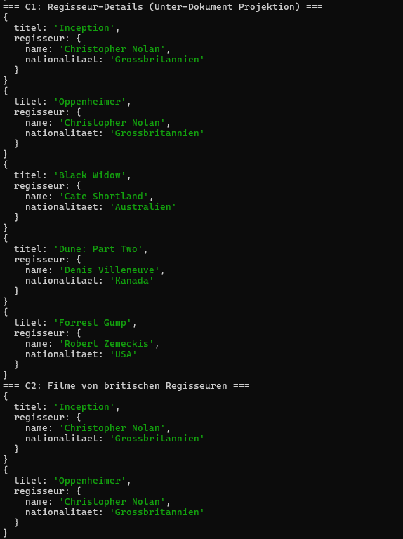
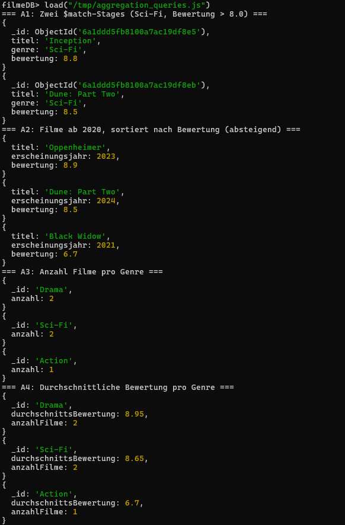
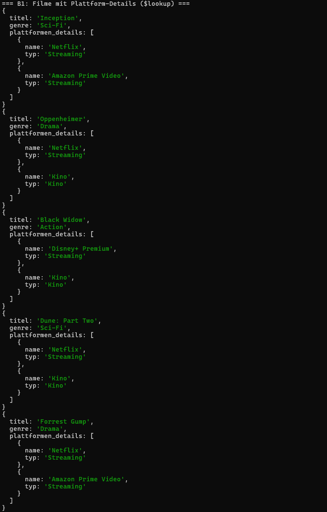
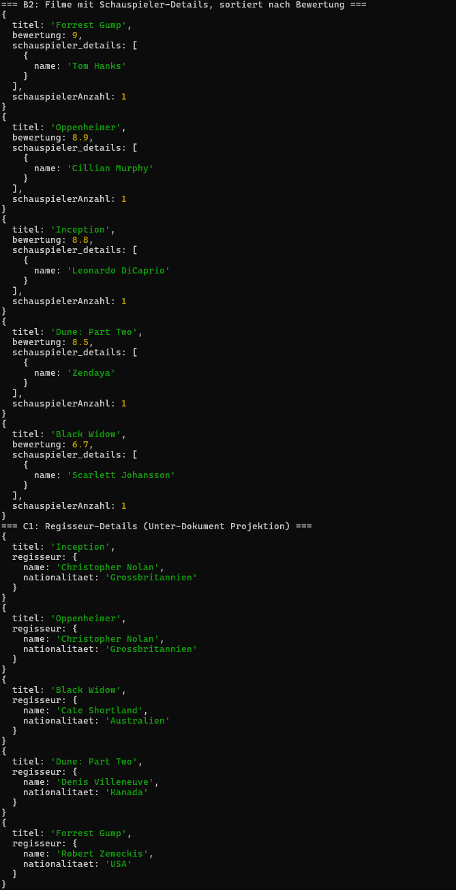
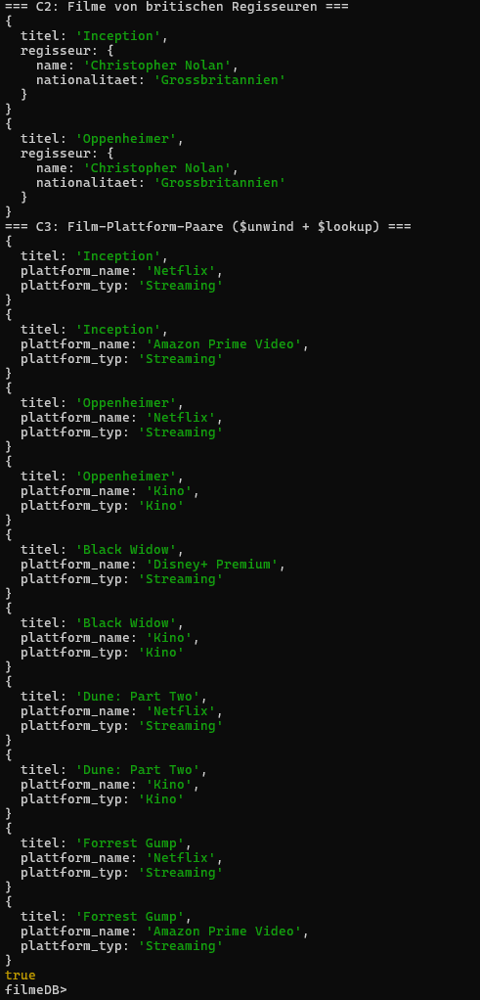

# KN-M-04: Datenmanipulation und Abfragen II

**Thema:** Filme & Serien  
**Datenbank:** `filmeDB`

---

## A) Aggregationen (50%)

### Script: [`aggregation_queries.js`](Dateien/aggregation_queries.js)

| # | Was | Technik |
|---|-----|---------|
| A1 | Sci-Fi Filme mit Bewertung > 8.0 | Zwei separate `$match`-Stages |
| A2 | Filme ab 2020, sortiert nach Bewertung | `$match` + `$project` + `$sort` |
| A3 | Anzahl Filme pro Genre | `$group` + `$sum` |
| A4 | Durchschnittsbewertung pro Genre | `$group` + `$avg` + `$sum` |

**A1 — Zwei `$match`-Stages:**

```javascript
db.filme.aggregate([
  { $match: { genre: "Sci-Fi" } },
  { $match: { bewertung: { $gt: 8.0 } } },
  { $project: { _id: 1, titel: 1, genre: 1, bewertung: 1 } }
]);
```

**A2 — `$match` + `$project` + `$sort`:**

```javascript
db.filme.aggregate([
  { $match: { erscheinungsjahr: { $gte: 2020 } } },
  { $project: { _id: 0, titel: 1, bewertung: 1, erscheinungsjahr: 1 } },
  { $sort: { bewertung: -1 } }
]);
```

**A3 — `$group` + `$sum`:**

```javascript
db.filme.aggregate([
  { $group: { _id: "$genre", anzahl: { $sum: 1 } } },
  { $sort: { anzahl: -1 } }
]);
```

**A4 — `$group` + `$avg` + `$sum`:**

```javascript
db.filme.aggregate([
  {
    $group: {
      _id: "$genre",
      durchschnittsBewertung: { $avg: "$bewertung" },
      anzahlFilme: { $sum: 1 }
    }
  },
  { $sort: { durchschnittsBewertung: -1 } }
]);
```

---

## B) Join-Aggregation (30%)

### Script: [`aggregation_queries.js`](Dateien/aggregation_queries.js)

| # | Was | Technik |
|---|-----|---------|
| B1 | Filme mit Plattform-Details | `$lookup` (filme → plattformen) + `$project` |
| B2 | Filme mit Schauspieler-Details, sortiert nach Bewertung | `$lookup` + `$addFields` + `$match` + `$sort` |

**B1 — `$lookup` auf Plattformen:**

```javascript
db.filme.aggregate([
  {
    $lookup: {
      from: "plattformen",
      localField: "plattform_ids",
      foreignField: "_id",
      as: "plattformen_details"
    }
  },
  {
    $project: {
      _id: 0,
      titel: 1,
      genre: 1,
      "plattformen_details.name": 1,
      "plattformen_details.typ": 1
    }
  }
]);
```

**B2 — `$lookup` auf Schauspieler mit Filterung:**

```javascript
db.filme.aggregate([
  {
    $lookup: {
      from: "schauspieler",
      localField: "schauspieler_ids",
      foreignField: "_id",
      as: "schauspieler_details"
    }
  },
  { $addFields: { schauspielerAnzahl: { $size: "$schauspieler_details" } } },
  { $match: { schauspielerAnzahl: { $gte: 1 } } },
  { $sort: { bewertung: -1 } },
  {
    $project: {
      _id: 0,
      titel: 1,
      bewertung: 1,
      schauspielerAnzahl: 1,
      "schauspieler_details.name": 1
    }
  }
]);
```

---

## C) Unter-Dokumente / Arrays (20%)

### Script: [`aggregation_queries.js`](Dateien/aggregation_queries.js)

| # | Was | Technik |
|---|-----|---------|
| C1 | Regisseur-Details anzeigen | `find()` mit Projektion auf Unter-Dokument |
| C2 | Filme von britischen Regisseuren | `find()` mit Filter auf `regisseur.nationalitaet` |
| C3 | Film-Plattform-Paare (flach) | `$unwind` + `$lookup` |

**C1 — Projektion auf Unter-Dokument:**

```javascript
db.filme.find(
  {},
  { _id: 0, titel: 1, "regisseur.name": 1, "regisseur.nationalitaet": 1 }
);
```

**C2 — Filter auf Unter-Dokument-Feld:**

```javascript
db.filme.find(
  { "regisseur.nationalitaet": "Grossbritannien" },
  { _id: 0, titel: 1, "regisseur.name": 1, "regisseur.nationalitaet": 1 }
);
```

**C3 — `$unwind` + `$lookup`:**

```javascript
db.filme.aggregate([
  { $unwind: "$plattform_ids" },
  {
    $lookup: {
      from: "plattformen",
      localField: "plattform_ids",
      foreignField: "_id",
      as: "plattform"
    }
  },
  { $unwind: "$plattform" },
  {
    $project: {
      _id: 0,
      titel: 1,
      plattform_name: "$plattform.name",
      plattform_typ: "$plattform.typ"
    }
  }
]);
```

---

## Abgabe-Dateien

| Datei | Teil | Beschreibung |
|---|---|---|
| [`aggregation_queries.js`](Dateien/aggregation_queries.js) | A, B, C | Aggregationen, Joins, Unter-Dokumente/Arrays |

---

## Screenshots






