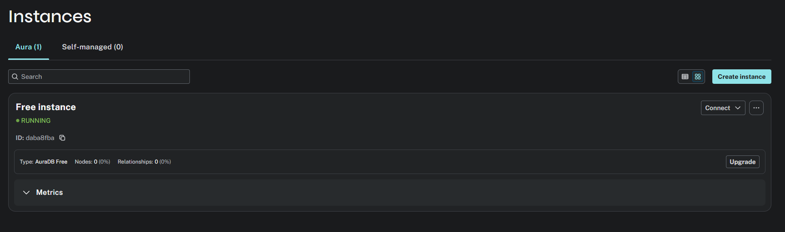
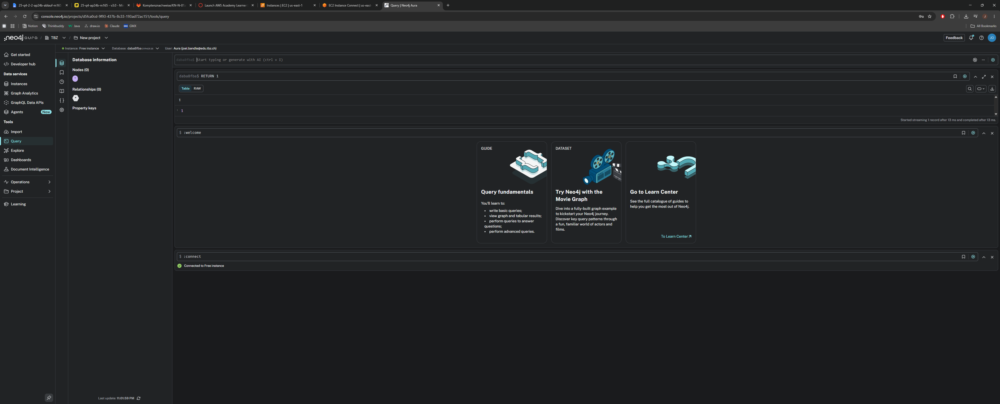
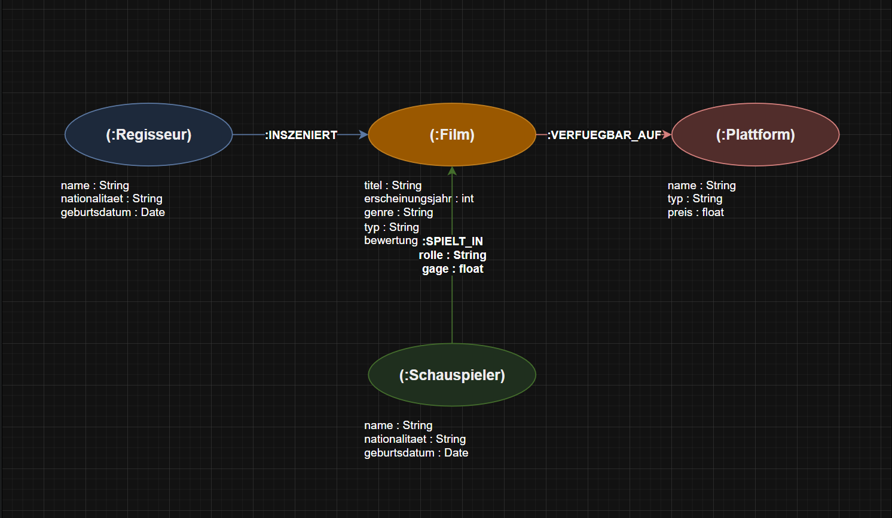

# KN-N-01: Installation und Datenmodellierung für Neo4j

---

## A) Installation / Account erstellen (30%)

---

## B) Logisches Modell für Neo4j (70%)

### Bild

### Draw.io-Datei

[neo4j-logisches-modell.drawio](neo4j-logisches-modell.drawio)

---

### Erklärung

#### Knoten

| Knoten | Attribute | Begründung |
|---|---|---|
| **:Film** (orange) | titel : String, erscheinungsjahr : int, genre : String, typ : String, bewertung : float | Zentrale Entität, die Regisseur, Schauspieler und Plattformen verbindet. |
| **:Regisseur** (blau) | name : String, nationalitaet : String, geburtsdatum : Date | Eigener Knoten, weil ein Regisseur mehrere Filme drehen kann. Ohne eigenen Knoten müsste man die Regisseur-Daten bei jedem Film wiederholen. |
| **:Schauspieler** (grün) | name : String, nationalitaet : String, geburtsdatum : Date | Eigener Knoten, weil ein Schauspieler in vielen Filmen mitspielen kann. |
| **:Plattform** (rot) | name : String, typ : String, preis : float | Eigener Knoten, weil mehrere Filme auf der gleichen Plattform verfügbar sein können. |

#### Kanten ohne Attribute

| Kante | Richtung | Kardinalität | Begründung |
|---|---|---|---|
| **:INSZENIERT** | Regisseur → Film | 1:N | Einfache Zuordnung – ein Regisseur hat einen Film gedreht. Keine zusätzlichen Daten nötig. |
| **:VERFUEGBAR_AUF** | Film → Plattform | N:M | Einfache Ja/Nein-Zuordnung – der Film ist auf der Plattform verfügbar oder nicht. |

#### Kanten MIT Attributen

| Kante | Richtung | Kardinalität | Attribute | Begründung |
|---|---|---|---|---|
| **:SPIELT_IN** | Schauspieler → Film | N:M | rolle : String, gage : float | Die Rolle gehört weder zum Schauspieler noch zum Film alleine – Schauspieler A spielt in Film X die Hauptrolle und in Film Y eine Nebenrolle. Die Gage ist ebenfalls pro Schauspieler-Film-Kombination unterschiedlich, deshalb auf der Kante. |

#### Warum keine IDs?

In Neo4j braucht man keine UUIDs als Primärschlüssel, weil Neo4j intern eigene IDs verwaltet. Beziehungen werden direkt über Kanten hergestellt, nicht über Foreign Keys wie in relationalen Datenbanken.

#### Unterschied zum konzeptionellen Modell

Im relationalen Modell braucht man Fremdschlüssel und Zwischentabellen für N:M-Beziehungen. In Neo4j werden diese direkt als Kanten dargestellt — einfacher und schneller bei Abfragen über mehrere Beziehungen.

---

## Screenshots

