# KN-N-02: Datenabfrage und -Manipulation (Neo4j)

**Thema:** Filme & Kino  
**Datenbank:** Neo4j AuraDB (Cypher)

---

## A) Daten hinzufügen (20%)

### Script: [`a_insert_data.txt`](Dateien/a_insert_data.txt)

Ein einziges grosses `CREATE`-Statement, das alle Knoten und Beziehungen auf einmal erstellt:

| Knoten | Anzahl |
|---|---|
| `:Regisseur` | 5 |
| `:Schauspieler` | 5 |
| `:Film` | 5 |
| `:Plattform` | 4 |

| Beziehung | Attribute | Anzahl |
|---|---|---|
| `:INSZENIERT` | — | 5 |
| `:SPIELT_IN` | rolle, gage | 7 |
| `:VERFUEGBAR_AUF` | — | 10 |

### Screenshots

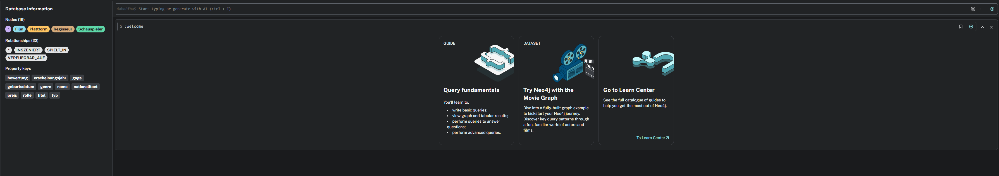

---

## B) Daten abfragen (20%)

### Script: [`b_query_data.txt`](Dateien/b_query_data.txt)

### OPTIONAL MATCH erklärt

```cypher
MATCH (n)
OPTIONAL MATCH (n)-[r]->(m)
RETURN n, r, m
```

- `MATCH (n)` findet **alle** Knoten in der Datenbank, unabhängig vom Label.
- `OPTIONAL MATCH (n)-[r]->(m)` versucht für jeden gefundenen Knoten `n` eine ausgehende Beziehung `r` zu einem Zielknoten `m` zu finden.
- **Wichtiger Unterschied zu einem normalen `MATCH`:** Wenn ein Knoten keine ausgehende Beziehung hat (z.B. eine `:Plattform`, auf die nur Kanten *zeigen*, von der aber keine ausgehen), bleibt der Knoten trotzdem im Ergebnis — `r` und `m` sind dann `NULL`.
- Bei einem normalen `MATCH` würde der Knoten **komplett aus dem Ergebnis herausfallen**, weil die Bedingung nicht erfüllt ist.
- `OPTIONAL MATCH` entspricht einem **LEFT JOIN** in SQL: Alle Zeilen der linken Seite bleiben erhalten, die rechte Seite ist `NULL` wenn keine Übereinstimmung gefunden wird.

### 4 Query-Szenarien

| # | Beschreibung | WHERE | Technik |
|---|---|---|---|
| Q1 | Hoch bewertete Thriller und Dramen (> 8.0) | `f.genre IN [...] AND f.bewertung > 8.0` | WHERE auf Knoten, mehrere Bedingungen |
| Q2 | Schauspieler mit Gage über 10 Mio. und ihre Rollen | `sp.gage > 10000000` | WHERE auf Kanten-Attribut |
| Q3 | Plattformen für Filme von Nolan oder Villeneuve | `r.name = "..." OR r.name = "..."` | Multi-Hop-Traversal über 3 Knoten |
| Q4 | Schauspieler mit mehr als einer Rolle und alle ihre Filme | `anzahl_rollen > 1` | WITH + COUNT + zweiter MATCH |

### Screenshots

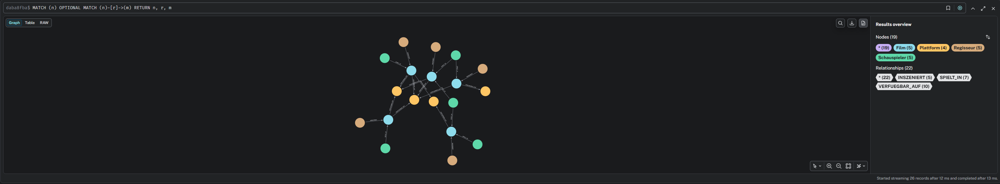
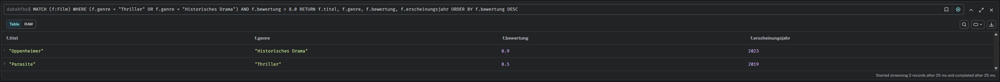
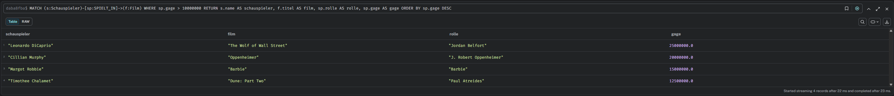
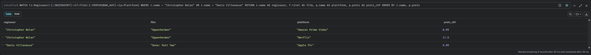
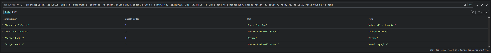

---

## C) Daten löschen (20%)

### Script: [`c_delete_data.txt`](Dateien/c_delete_data.txt)

### Ohne DETACH — Fehler

```cypher
MATCH (r:Regisseur {name: "Greta Gerwig"})
DELETE r
```

**Ergebnis:** Fehler — `Cannot delete node, because it still has relationships.`  
Neo4j erlaubt es nicht, einen Knoten zu löschen, der noch Kanten hat. Greta Gerwig hat eine ausgehende `:INSZENIERT`-Beziehung zum Film "Barbie", die erst entfernt werden müsste.

### Mit DETACH DELETE — Erfolg

```cypher
MATCH (r:Regisseur {name: "Greta Gerwig"})
DETACH DELETE r
```

**Ergebnis:** Knoten wird zusammen mit allen seinen Beziehungen (hier: `:INSZENIERT`) in einem einzigen Statement gelöscht. Neo4j entfernt zuerst die Kanten, dann den Knoten selbst.

### Screenshots

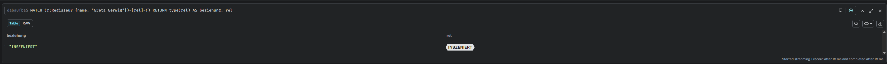
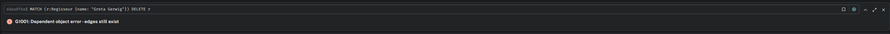
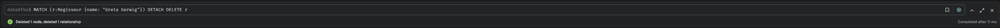
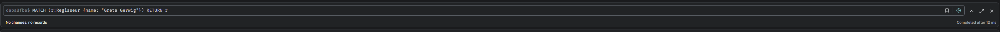

---

## D) Daten verändern (20%)

### Script: [`d_update_data.txt`](Dateien/d_update_data.txt)

| # | Was | Cypher-Technik |
|---|---|---|
| U1 | "Barbie" erhält neue Bewertung (7.2) und präzisierteres Genre | `SET` auf zwei Knoten-Attributen |
| U2 | Netflix erhöht Abo-Preis von 17.90 auf 19.90 CHF | `SET` auf einem Knoten-Attribut |
| U3 | DiCaprio bekommt höhere Gage für "Wolf of Wall Street" (30 Mio.) | `SET` auf Attribut einer `:SPIELT_IN`-Kante |

### Screenshots

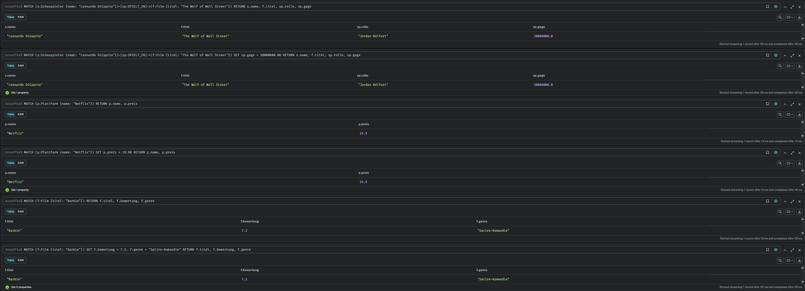

---

## E) Zusätzliche Klauseln (20%)

### Script: [`e_additional_clauses.txt`](Dateien/e_additional_clauses.txt)

### 1) LIMIT — Ergebnisse begrenzen

`LIMIT` schneidet das Ergebnis nach einer bestimmten Anzahl von Zeilen ab. Es wird am Ende eines Statements angehängt, nach `ORDER BY`. In Kombination mit `ORDER BY` ergibt sich ein klassischer **Top-N-Filter**.

```cypher
MATCH (f:Film)
RETURN f.titel, f.bewertung, f.genre
ORDER BY f.bewertung DESC
LIMIT 3
```

**Erklärung:** `MATCH` findet alle Filme, `ORDER BY f.bewertung DESC` sortiert sie absteigend nach Bewertung, und `LIMIT 3` gibt nur die drei bestbewerteten zurück. Ohne `ORDER BY` wären die drei zurückgegebenen Filme zufällig — also immer mit `ORDER BY` kombinieren, wenn man gezielt "die besten" will.

### 2) UNWIND — Liste in einzelne Zeilen auflösen

`UNWIND` nimmt ein Array und "entfaltet" es: jedes Element wird zu einer eigenen Zeile. Das entspricht einem `foreach` in einer Programmiersprache — für jedes Element in der Liste wird der restliche Query einmal ausgeführt. Typischer Anwendungsfall: Man hat eine Liste von Titeln oder IDs und will diese alle in einem Schritt nachschlagen, statt mehrere separate Abfragen zu schreiben.

```cypher
UNWIND ["Oppenheimer", "Parasite", "Dune: Part Two"] AS gesuchter_titel
MATCH (f:Film {titel: gesuchter_titel})
RETURN f.titel, f.bewertung, f.genre
ORDER BY f.bewertung DESC
```

**Erklärung:** `UNWIND` erzeugt aus der Liste drei separate Zeilen — die Variable `gesuchter_titel` nimmt nacheinander die Werte "Oppenheimer", "Parasite" und "Dune: Part Two" an. `MATCH` sucht für jeden Titel den passenden Filmknoten. Das Ergebnis sind drei Zeilen mit Titel, Bewertung und Genre, sortiert nach Bewertung.

### Screenshots

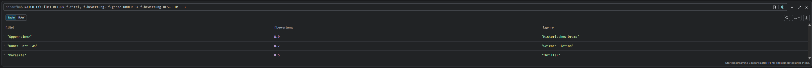
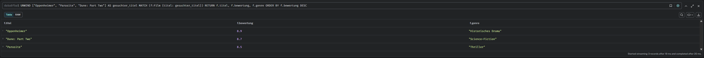

---

## Abgabe-Dateien

| Datei | Teil | Beschreibung |
|---|---|---|
| [`a_insert_data.txt`](Dateien/a_insert_data.txt) | A | Alle Knoten und Beziehungen erstellen (CREATE) |
| [`b_query_data.txt`](Dateien/b_query_data.txt) | B | OPTIONAL MATCH Erklärung + 4 Query-Szenarien |
| [`c_delete_data.txt`](Dateien/c_delete_data.txt) | C | DELETE vs. DETACH DELETE |
| [`d_update_data.txt`](Dateien/d_update_data.txt) | D | 3 Update-Szenarien (SET auf Knoten + Kante) |
| [`e_additional_clauses.txt`](Dateien/e_additional_clauses.txt) | E | LIMIT + UNWIND erklärt mit Beispielen |
