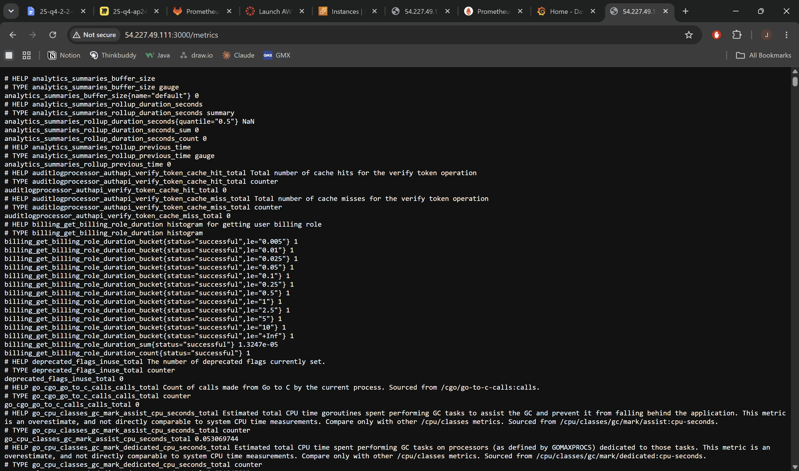
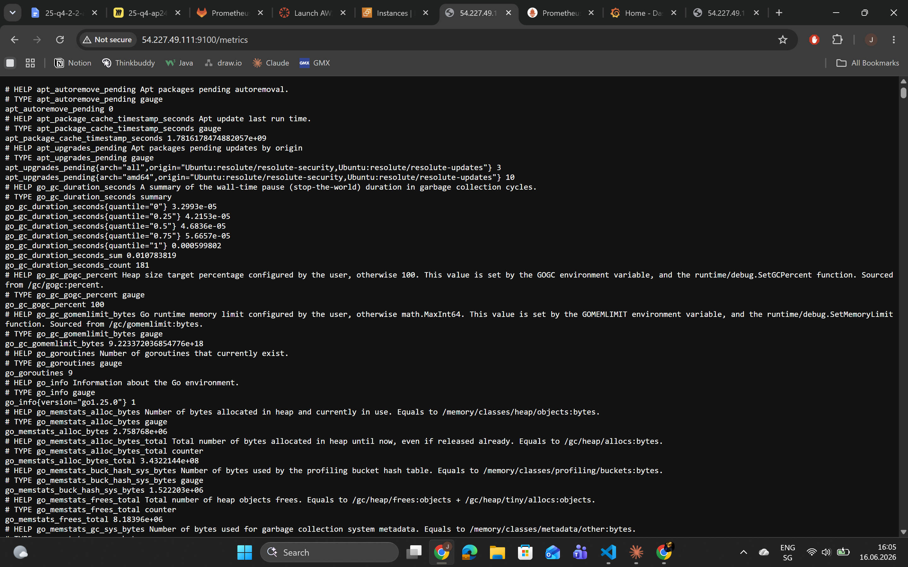
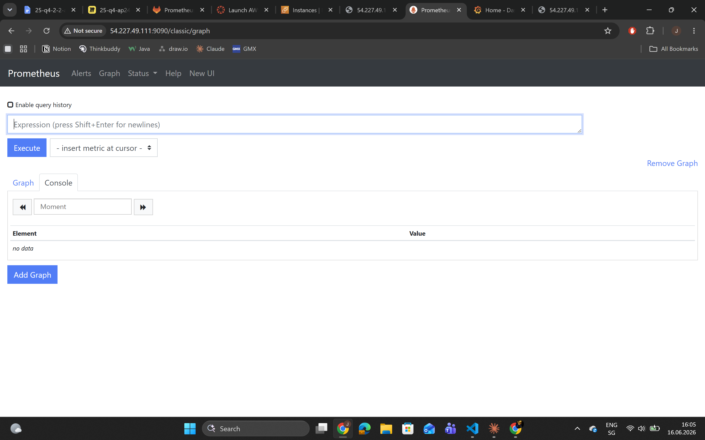
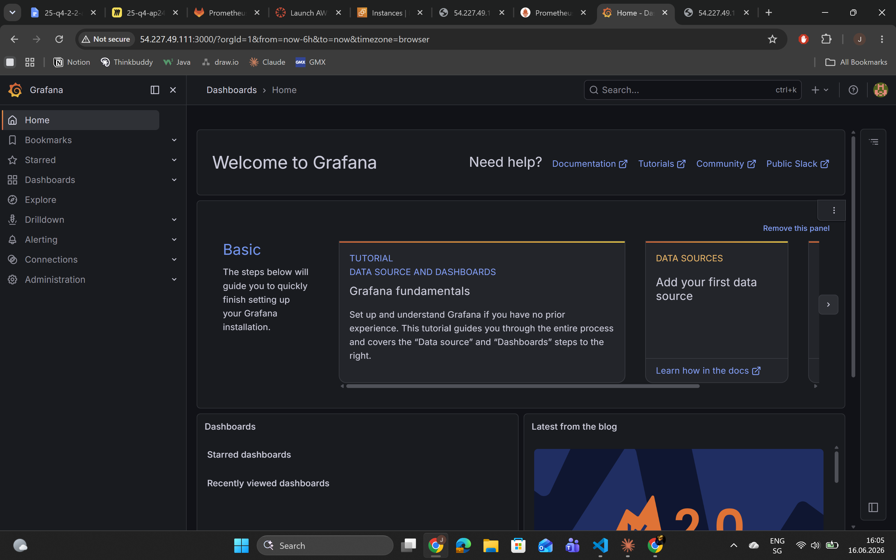

# KN-P-01: Installation von Prometheus und Grafana

---

## A) Installation (50%)

### Screenshots






---

## B) Erklärungen Cloud-Init (50%)

### 1. Was sind Scrapes?

Ein **Scrape** ist der Vorgang, bei dem Prometheus aktiv Metriken von einem Ziel (Target) abruft. Prometheus funktioniert nach dem **Pull-Prinzip**: Es geht selbst zu den konfigurierten Endpunkten und holt die Daten — im Gegensatz zu anderen Monitoring-Systemen, bei denen die Anwendungen die Daten selbst wegschicken (Push).

In der `prometheus.yml` ist definiert, wie oft und von wo Prometheus scrapt:

```yaml
global:
  scrape_interval: 15s
```

Das bedeutet: Alle 15 Sekunden fragt Prometheus jeden konfigurierten Endpunkt ab.

```yaml
scrape_configs:
  - job_name: prometheus
    static_configs:
      - targets: ['localhost:9090']
  - job_name: node
    static_configs:
      - targets: ['localhost:9100']
```

**Konkrete Beispiele aus der Konfiguration:**

- **Job `prometheus`**: Prometheus scrapt sich selbst auf Port `9090`. Es überwacht also seinen eigenen Zustand (z.B. wie viele Scrapes fehlgeschlagen sind, wie viel Speicher Prometheus selbst verbraucht).
- **Job `node`**: Prometheus scrapt den **Node Exporter** auf Port `9100`. Der Node Exporter ist ein separater Prozess, der Systemmetriken des Servers bereitstellt — CPU-Auslastung, RAM-Nutzung, Festplattenplatz, Netzwerktraffic usw.

Die gescrapten Daten werden als Zeitreihen in der internen Prometheus-Datenbank gespeichert und können dann abgefragt oder für Alerts verwendet werden.

---

### 2. Was sind Rules?

**Rules** (Regeln) sind vordefinierte Berechnungen oder Bedingungen, die Prometheus regelmässig auswertet. Es gibt zwei Typen:

**a) Recording Rules** — Vorberechnete Metriken

Recording Rules berechnen aus bestehenden Metriken neue, abgeleitete Metriken und speichern diese unter einem neuen Namen. Das ist nützlich, wenn eine Berechnung komplex ist und man sie nicht bei jeder Abfrage neu durchführen will.

Aus der `rules.yml`:

```yaml
- record: node_memory_MemFree_percent
  expr: 100 - (100 * node_memory_MemFree_bytes / node_memory_MemTotal_bytes)
```
→ Berechnet den **prozentualen Anteil des belegten Arbeitsspeichers** aus den Rohwerten in Bytes. Das Ergebnis wird unter dem neuen Namen `node_memory_MemFree_percent` gespeichert und kann direkt in Grafana verwendet werden.

```yaml
- record: node_filesystem_free_percent
  expr: 100 * node_filesystem_free_bytes{mountpoint="/"} / node_filesystem_size_bytes{mountpoint="/"}
```
→ Berechnet den **prozentualen freien Festplattenplatz** auf dem Root-Dateisystem `/`. Auch hier wird das Ergebnis als neue Metrik gespeichert.

**b) Alerting Rules** — Alarmregeln

Alerting Rules definieren Bedingungen, bei denen Prometheus einen Alert auslöst.

Aus der `rules.yml`:

```yaml
- alert: InstanceDown
  expr: up == 0
  for: 1m
  labels:
    severity: critical
  annotations:
    summary: "Instance {{ $labels.instance }} down"
    description: "Instance {{ $labels.instance }} of job {{ $labels.job }} has been down for more than 1 minute."
```
→ Wenn eine Instanz länger als 1 Minute nicht erreichbar ist (`up == 0`), wird ein Alert mit dem Namen `InstanceDown` ausgelöst, markiert als `critical`.

---

### 3. Schritte um eigene Daten in Prometheus zu speichern

Als Programmierer müssen folgende Schritte ausgeführt werden:

**Schritt 1 — Exporter einbauen oder selbst schreiben**
Die eigene Anwendung muss einen HTTP-Endpunkt bereitstellen (standardmässig `/metrics`), der Metriken im Prometheus-Textformat ausgibt. Dafür gibt es Client-Libraries für alle gängigen Sprachen (Python, Java, Go, Node.js usw.).

Beispiel in Python mit der `prometheus_client`-Library:
```python
from prometheus_client import Counter, start_http_server
requests_total = Counter('app_requests_total', 'Anzahl HTTP Requests')
start_http_server(8000)
```

**Schritt 2 — Endpunkt in `prometheus.yml` registrieren**
Der neue Endpunkt wird als neuer Job in der `scrape_configs` eingetragen:
```yaml
scrape_configs:
  - job_name: meine_app
    static_configs:
      - targets: ['localhost:8000']
```

**Schritt 3 — Prometheus neu starten**
```bash
sudo systemctl restart prometheus
```

**Schritt 4 — Optional: Recording Rules definieren**
Falls komplexe Berechnungen nötig sind, werden diese in `rules.yml` definiert.

**Schritt 5 — In Grafana visualisieren**
Die neuen Metriken können in Grafana mit PromQL abgefragt und in Dashboards dargestellt werden.

---

### 4. Welche Variablen werden verwendet in Scrapes und Rules?

**In den Scrapes (`prometheus.yml`):**

| Variable | Wert | Herkunft |
|---|---|---|
| `scrape_interval` | `15s` | Global definiert — gilt für alle Jobs |
| `job_name: prometheus` | `prometheus` | Frei gewählter Name für den Job |
| `targets: localhost:9090` | `localhost:9090` | Prometheus scrapt sich selbst — Port 9090 ist der Standard-Port von Prometheus |
| `job_name: node` | `node` | Frei gewählter Name für den Node Exporter Job |
| `targets: localhost:9100` | `localhost:9100` | Port des Node Exporters — standardmässig 9100 |

**In den Rules (`rules.yml`):**

| Variable | Herkunft |
|---|---|
| `node_memory_MemFree_bytes` | Vom **Node Exporter** geliefert via `http://localhost:9100/metrics` |
| `node_memory_MemTotal_bytes` | Vom **Node Exporter** geliefert via `http://localhost:9100/metrics` |
| `node_filesystem_free_bytes` | Vom **Node Exporter** geliefert via `http://localhost:9100/metrics` |
| `node_filesystem_size_bytes` | Vom **Node Exporter** geliefert via `http://localhost:9100/metrics` |
| `up` | Von **Prometheus selbst** generiert — 1 wenn der Scrape erfolgreich war, 0 wenn nicht |
| `$labels.instance` | Automatisch von Prometheus gesetzt — enthält die Target-Adresse (z.B. `localhost:9100`) |
| `$labels.job` | Automatisch von Prometheus gesetzt — enthält den Job-Namen (z.B. `node`) |

Alle Metriken die mit `node_` beginnen kommen vom Node Exporter und sind unter `http://localhost:9100/metrics` abrufbar. Die Variable `up` ist eine interne Prometheus-Metrik.

---

### 5. Wie weiss Prometheus ob ein System *up* ist?

Prometheus generiert nach jedem Scrape-Versuch automatisch eine interne Metrik namens `up`:

- **`up == 1`** → Der Scrape war erfolgreich, das System ist erreichbar.
- **`up == 0`** → Der Scrape ist fehlgeschlagen, das System antwortet nicht.

In der Alerting Rule wird genau das geprüft:

```yaml
- alert: InstanceDown
  expr: up == 0
  for: 1m
```

Prometheus versucht alle 15 Sekunden (gemäss `scrape_interval`) die konfigurierten Targets zu erreichen. Wenn ein Target nicht antwortet, setzt Prometheus `up = 0` für dieses Target. Die `for: 1m` Bedingung bedeutet, dass der Alert erst ausgelöst wird, wenn `up == 0` **mindestens 1 Minute lang** andauert — so werden kurze, einmalige Verbindungsunterbrüche nicht sofort als kritisch gemeldet.

Das `up`-Label enthält dabei sowohl `instance` (z.B. `localhost:9100`) als auch `job` (z.B. `node`), damit man genau weiss welches System ausgefallen ist.
