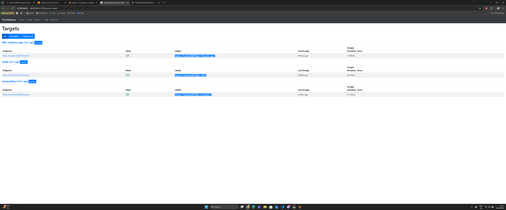
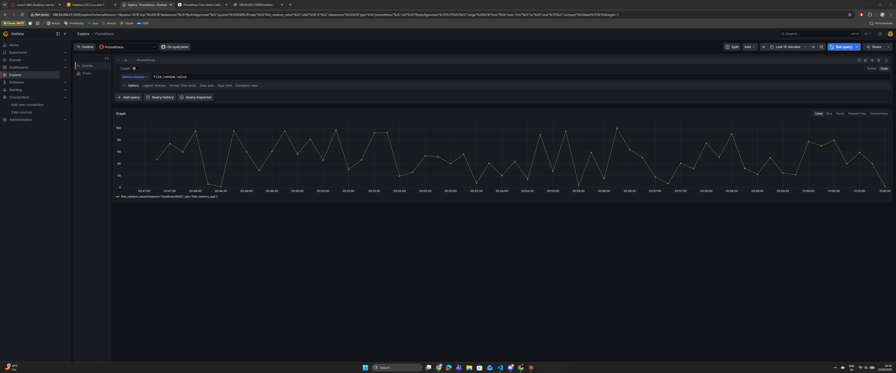

# KN-P-02: Implementation von eigenen Metrics

**Thema:** Filme & Serien  
**Server:** AWS EC2 (Ubuntu) — IP: `100.59.200.21`  
**Sprache:** Python (Flask)

---

## A) Eigene Metriken schreiben (20%)

### Script: [`Dateien/metrics_app.py`](Dateien/metrics_app.py)

Eine einfache Flask-Applikation mit einem `/metrics`-Endpoint. Bei jedem Aufruf wird eine neue Zufallszahl zwischen 0 und 100 generiert und im Prometheus-Textformat zurückgegeben. Dies simuliert z.B. Echtzeit-Daten wie Anzahl aktiver Nutzer, aktuelle Bewertungen oder Auslastungswerte.

```python
import random
from flask import Flask, Response

app = Flask(__name__)

@app.route('/metrics')
def metrics():
    random_value = random.uniform(0, 100)
    output = '# HELP film_random_value Zufallszahl zwischen 0 und 100\n'
    output += '# TYPE film_random_value gauge\n'
    output += f'film_random_value {random_value:.2f}\n'
    return Response(output, mimetype='text/plain')

if __name__ == '__main__':
    app.run(host='0.0.0.0', port=8000)
```

**Erklärung des Formats:**
- `# HELP` — Beschreibung der Metrik für Prometheus
- `# TYPE gauge` — Typ: ein aktueller Messwert (im Gegensatz zu `counter` der nur steigt)
- `film_random_value 42.37` — Name und aktueller Wert der Metrik

### Screenshot: App läuft auf Port 8000



---

## B) Umgebung einrichten (80%)

### Deployment auf AWS EC2

Die App wurde auf derselben AWS-Instanz wie Prometheus und Grafana deployed (IP: `100.59.200.21`).

**Installationsschritte auf dem Server:**

```bash
# 1. Flask installieren
sudo apt-get install -y python3-flask

# 2. App-Datei erstellen
nano /home/ubuntu/metrics_app.py

# 3. Systemd Service erstellen für automatischen Start
sudo nano /etc/systemd/system/metrics-app.service

# 4. Service aktivieren und starten
sudo systemctl daemon-reload
sudo systemctl enable metrics-app
sudo systemctl start metrics-app
```

**Systemd Service** ([`Dateien/metrics-app.service`](Dateien/metrics-app.service)):

```ini
[Unit]
Description=Film Metrics App
After=network.target

[Service]
User=ubuntu
WorkingDirectory=/home/ubuntu
ExecStart=/usr/bin/python3 /home/ubuntu/metrics_app.py
Restart=always

[Install]
WantedBy=multi-user.target
```

Der Service sorgt dafür, dass die App automatisch beim Serverstart läuft und bei Abstürzen neu gestartet wird.

---

### Prometheus Scrape erweitern

**Datei:** [`Dateien/prometheus.yml`](Dateien/prometheus.yml)

Ein neuer Job `film_metrics_app` wurde zur `prometheus.yml` hinzugefügt:

```yaml
global:
  scrape_interval: 15s

scrape_configs:
  - job_name: prometheus
    static_configs:
      - targets: ['localhost:9090']

  - job_name: node
    static_configs:
      - targets: ['localhost:9100']

  - job_name: film_metrics_app
    static_configs:
      - targets: ['localhost:8000']

rule_files:
  - "/etc/prometheus/rules.yml"
```

Prometheus scrapt nun alle 15 Sekunden den `/metrics`-Endpoint der Python-App auf Port 8000 und speichert die `film_random_value`-Metrik als Zeitreihe.

**Neustart nach Konfigurationsänderung:**
```bash
sudo systemctl restart prometheus
```

### Screenshot: Prometheus Targets — alle UP

Alle drei Targets sind **UP**:
- `film_metrics_app` → `localhost:8000` ✅
- `node` → `localhost:9100` ✅
- `prometheus` → `localhost:9090` ✅


---

### Grafana Dashboard erweitern

In Grafana wurde Prometheus als Data Source verbunden und ein neues Dashboard **"Film Metrics Dashboard"** erstellt mit einem Panel das `film_random_value` als Zeitreihen-Graph anzeigt.

**PromQL-Abfrage im Panel:**
```
film_random_value
```

Das Dashboard aktualisiert sich alle 5 Sekunden automatisch und zeigt die letzten 15 Minuten der Zufallswerte.

### Screenshot: Grafana Dashboard mit film_random_value



---

## Abgabe-Dateien

| Datei | Beschreibung |
|---|---|
| [`Dateien/metrics_app.py`](Dateien/metrics_app.py) | Python Flask App mit /metrics Endpoint |
| [`Dateien/prometheus.yml`](Dateien/prometheus.yml) | Erweiterte Prometheus Konfiguration mit neuem Scrape Job |
| [`Dateien/metrics-app.service`](Dateien/metrics-app.service) | Systemd Service für automatischen Start der App |
